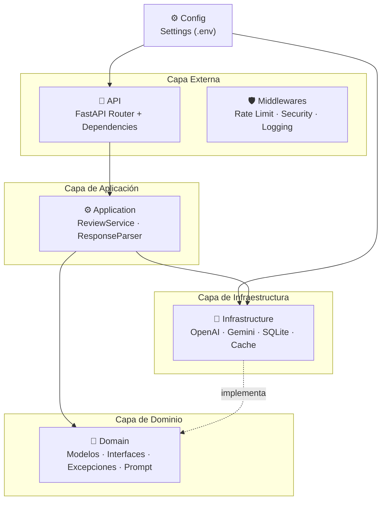
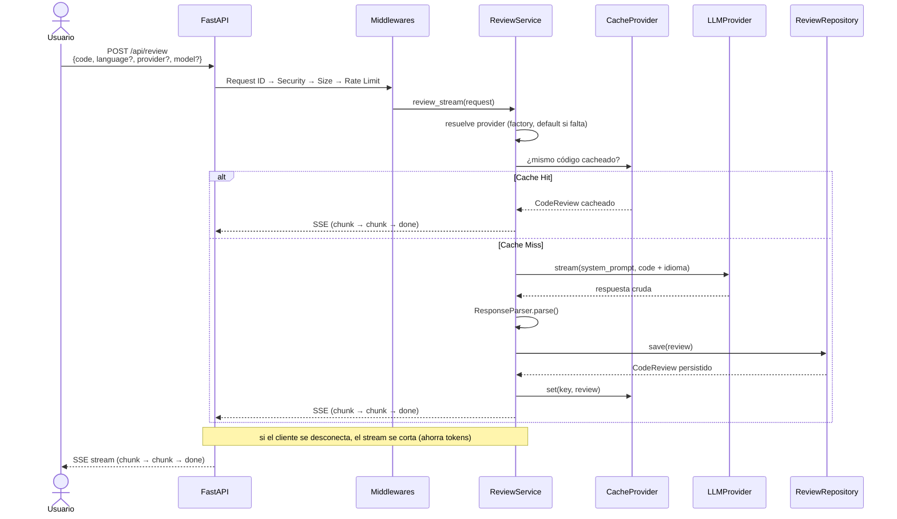

# Refactorly API

Backend para una aplicación de **code review asistida por LLM**. El usuario envía código fuente, el backend
lo remite a un modelo de lenguaje (OpenAI, Gemini) con un system prompt especializado en revisión y refactoring,
y retorna el código original anotado con los problemas encontrados junto a una explicación detallada
(por qué, cuándo y cómo corregir cada issue).

El LLM actúa como **copiloto** — sugiere y hace pensar — **no** reescribe código automáticamente.

---

## Stack

| Capa | Tecnología |
|------|-----------|
| Framework | FastAPI + Uvicorn |
| LLM | LangChain (OpenAI, Gemini, extensible) |
| Persistencia | SQLite asíncrono (`aiosqlite`) |
| Rate Limiting | slowapi (in-memory) |
| Validación | Pydantic v2 + pydantic-settings |
| Streaming | Server-Sent Events (`sse-starlette`) |
| Logging | structlog (estructurado) |

---

## Arquitectura: Clean Architecture

El proyecto sigue Clean Architecture con dependencias estrictamente dirigidas hacia adentro.
Cada capa solo conoce a la capa inmediatamente inferior.



### Principios SOLID aplicados

| Principio | Cómo se cumple |
|-----------|---------------|
| **S** — Single Responsibility | `ReviewService` orquesta, `ResponseParser` parsea, `MemomyCache` cachea, `SQLiteReviewRepository` persiste. Una razón para cambiar cada clase. |
| **O** — Open/Closed | Agregar un provider (Anthropic, DeepSeek) requiere solo una clase nueva + una línea en `LLMProviderFactory`. Cero cambios en el resto del sistema. |
| **L** — Liskov Substitution | `OpenAIProvider` y `GeminiProvider` son intercambiables vía la interfaz `LLMProvider`. `SQLiteReviewRepository` y `MemomyCache` implementan `ReviewRepository` y `CacheProvider` respectivamente. |
| **I** — Interface Segregation | Interfaces pequeñas y específicas: `LLMProvider` (3 métodos), `ReviewRepository` (4), `CacheProvider` (3). |
| **D** — Dependency Inversion | `ReviewService` depende de interfaces (`LLMProvider`, `ReviewRepository`, `CacheProvider`), no de implementaciones concretas. La inyección ocurre en `dependencies.py`. |

---

## Flujo de una Review



### Streaming (Server-Sent Events)

El endpoint `POST /api/review` responde con un stream SSE:

```
event: chunk
data: Aquí tienes tu código revisado...

event: chunk
data: [ISSUE-1] La función no tiene type hints...

event: done
data:
```

El frontend renderiza cada chunk en tiempo real mientras el LLM genera la respuesta.

---

## Funcionalidades de Seguridad

| Fase | Funcionalidad | Implementación |
|------|--------------|----------------|
| 1 | **Rate Limiting** | `slowapi` con `SlowAPIMiddleware`. 5 req/min para POST, 30 req/min para GET/DELETE. Backend en memoria, configurable desde `.env`. |
| 2 | **Response Caching** | `MemomyCache` (TTL configurable). Si dos usuarios envían el mismo código dentro del TTL, se devuelve la respuesta cacheada sin llamar al LLM. Aplica también al POST streaming: la respuesta cacheada se reemite como chunks. |
| 3 | **Security Headers** | `SecurityHeadersMiddleware`: `X-Content-Type-Options`, `X-Frame-Options`, `Referrer-Policy`, `X-Permitted-Cross-Domain-Policies`. |
| 3 | **Request Size Limit** | `RequestSizeLimitMiddleware`: rechaza payloads mayores al máximo configurado con HTTP 413. |
| 4 | **Structured Logging** | `structlog` con `RequestIdMiddleware`: cada request recibe un UUID trazable en todos los logs. |

### Orden de ejecución de middlewares


Todas las responses (200, 413, 429) pasan por `SecurityHeadersMiddleware` y `CORS`, garantizando que los headers de seguridad y CORS estén siempre presentes.

---

## Estructura del Proyecto

```
app/
├── main.py                          # Entry point FastAPI + middleware stack
├── config/
│   ├── __init__.py
│   ├── settings.py                  # Pydantic Settings (.env)
│   └── logging.py                   # structlog configuration
├── domain/                          # Capa más interna, sin dependencias
│   ├── __init__.py                  # Barrel exports
│   ├── exceptions.py                # RefactorlyError + InvalidCodeError + ReviewNotFoundError + LLMProviderError
│   ├── interfaces.py                # LLMProvider · ReviewRepository · CacheProvider (ABCs)
│   ├── models.py                    # CodeReview · ReviewRequest · ReviewResponse
│   └── prompts.py                   # System prompt del copiloto
├── infrastructure/                  # Implementaciones concretas
│   ├── __init__.py
│   ├── llm/
│   │   ├── base_provider.py         # BaseLLMProvider (Template Method con LangChain)
│   │   ├── openai_provider.py       # OpenAIProvider (ChatOpenAI)
│   │   ├── gemini_provider.py       # GeminiProvider (ChatGoogleGenerativeAI)
│   │   └── factory_provider.py      # LLMProviderFactory
│   ├── database/
│   │   └── sqlite.py                # SQLiteReviewRepository (aiosqlite)
│   └── cache/
│       └── memory.py                # MemomyCache (dict + TTL)
├── application/                     # Lógica de negocio
│   ├── __init__.py
│   └── services/
│       ├── review.py                # ReviewService (orquestador)
│       └── parser.py                # ResponseParser (split de respuesta LLM)
├── api/                             # Capa de presentación
│   ├── __init__.py
│   ├── router.py                    # Endpoints REST + SSE
│   ├── dependencies.py              # Inyección de dependencias (singleton)
│   ├── streaming.py                 # Presentador SSE + corte por desconexión
│   └── limiter.py                   # slowapi Limiter instance
└── middleware/                       # Middlewares HTTP
    ├── __init__.py
    ├── security.py                  # SecurityHeaders + RequestSizeLimit
    └── logging.py                   # RequestIdMiddleware
run.py                               # Uvicorn entry point (desarrollo)
requirements.txt
.env.example                         # Plantilla de variables de entorno
.env                                 # Variables de entorno (no comitear)
.gitignore                           # Archivos ignorados (.env, .venv, *.db)
```

---

## Instalación y Ejecución

```bash
# 1. Clonar y crear entorno virtual
python3 -m venv venv
source venv/bin/activate

# 2. Instalar dependencias
pip install -r requirements.txt

# 3. Configurar variables de entorno
cp .env.example .env
# Editar .env con tus API keys

# 4. Ejecutar en desarrollo
python run.py
# o directamente:
fastapi dev app/main.py
```

El servidor estará disponible en `http://localhost:8000`.

Documentación interactiva (Swagger): `http://localhost:8000/docs`

---

## Variables de Entorno (`.env`)

| Variable | Requerida | Default | Descripción |
|----------|:---:|---------|-------------|
| `OPENAI_API_KEY` | Sí | — | API key de OpenAI |
| `GEMINI_API_KEY` | Sí | — | API key de Gemini |
| `DEEPSEEK_API_KEY` | Sí | — | API key de DeepSeek |
| `DEFAULT_PROVIDER` | Sí | — | Provider por defecto (`openai`, `gemini`, `deepseek`) |
| `DEFAULT_MODEL` | Sí | — | Modelo por defecto (`gpt-4o`, `gemini-2.5-flash-lite`, etc.) |
| `LLM_TEMPERATURE` | Sí | — | Temperatura del LLM (0.0 a 2.0) |
| `DATABASE_PATH` | Sí | — | Ruta del archivo SQLite |
| `HOST` | Sí | — | Host del servidor |
| `PORT` | Sí | — | Puerto del servidor |
| `CORS_ORIGINS` | Sí | — | Orígenes CORS (coma-separados) |
| `LOG_LEVEL` | Sí | — | Nivel de logging (`DEBUG`, `INFO`, `WARNING`, `ERROR`) |
| `REVIEW_RATE_LIMIT` | No | `5/minute` | Rate limit para POST /api/review |
| `HISTORY_RATE_LIMIT` | No | `30/minute` | Rate limit para GET/DELETE |
| `CACHE_TTL_SECONDS` | No | `900` | TTL del caché en segundos (0 = deshabilitado) |
| `MAX_BOY_SIZE` | No | `100000` | Tamaño máximo del body en bytes |
| `MAX_TOKENS` | No | `4096` | Máximo de tokens de salida por review |

---

## Endpoints de la API

| Método | Ruta | Descripción | Rate Limit |
|--------|------|-------------|:---:|
| `POST` | `/api/review` | Envía código para revisión. Responde con **SSE stream** en tiempo real. | 5/min |
| `GET` | `/api/review/history` | Lista todas las reviews pasadas (más recientes primero). | 30/min |
| `GET` | `/api/review/{id}` | Obtiene una review por ID. | 30/min |
| `DELETE` | `/api/review/{id}` | Elimina una review por ID. | 30/min |

### Ejemplo de request

```bash
curl -X POST http://localhost:8000/api/review \
  -H "Content-Type: application/json" \
  -d '{"code": "def add(a, b):\n    return a + b", "language": "python", "response_language": "es"}'
```

### Ejemplo de response (SSE)

```
event: chunk
data: ### Annotated Code

event: chunk  
data: ```python
def add(a, b):  # [ISSUE-1] Missing type hints

event: chunk
data:     return a + b  # [ISSUE-2] Missing docstring
```

event: chunk
data: ### Detailed Explanation...

event: done
data:
```

### Idioma de respuesta

El campo `response_language` del request controla el idioma en que el copiloto responde:

| Valor | Idioma |
|-------|--------|
| `"es"` | Español (default) |
| `"en"` | Inglés |

El idioma se incluye como instrucción en el mensaje enviado al LLM y forma parte de la clave del caché — una review en español y una en inglés del mismo código se cachean por separado.

```bash
# Review en inglés (opcional)
curl -X POST http://localhost:8000/api/review \
  -H "Content-Type: application/json" \
  -d '{"code": "def add(a, b):\n    return a + b", "language": "python", "response_language": "en"}'
```

Cualquier otro valor distinto a `"es"` o `"en"` genera un error de validación 422.

### Selección de provider y modelo (por request)

El backend soporta que el frontend elija el provider y el modelo en cada request mediante los campos opcionales `provider` y `model`. Si se omiten, se usan `DEFAULT_PROVIDER` y `DEFAULT_MODEL`.

```bash
# Selección explícita de provider + modelo
curl -N -X POST http://localhost:8000/api/review \
  -H "Content-Type: application/json" \
  -d '{"code": "def suma(a, b):\n    return a + b", "provider": "gemini", "model": "gemini-2.5-flash-lite"}'

# Fallback a defaults (sin provider/model)
curl -N -X POST http://localhost:8000/api/review \
  -H "Content-Type: application/json" \
  -d '{"code": "def suma(a, b):\n    return a + b"}'
```

`provider` y `model` forman parte de la clave del caché — una review del mismo código con modelos distintos se cachea por separado.

### Optimización de tokens

| Mecanismo | Ahorro | Transparente al frontend |
|-----------|--------|:---:|
| `MemomyCache` | 0 tokens para código idéntico dentro del TTL | ✅ |
| `MAX_TOKENS` | Tope de salida que corta respuestas desbocadas | ✅ |
| Prompt caching de OpenAI | -50% en input repetido (automático) | ✅ |
| `SYSTEM_PROMPT` recortado | Menos tokens de entrada por request | ✅ |

El consumo de tokens por request se loguea (`llm_tokens`) con su `request_id` para poder monitorear el uso del tier gratuito.

---

## Decisiones de Diseño

### ¿Por qué Clean Architecture y no MVC?

MVC mezcla lógica de negocio con infraestructura en el controller. Clean Architecture fuerza a que el dominio no dependa de nada externo. Si mañana OpenAI desaparece, solo cambiás `openai_provider.py`. El resto del sistema ni se entera.

### ¿Por qué ABC y no Protocol para las interfaces?

`ABC` con `@abstractmethod` requiere herencia explícita. El IDE te avisa si no implementaste todos los métodos. `Protocol` usa duck typing estructural y falla en runtime. Para contratos de arquitectura, ABC es más seguro y explícito.

### ¿Por qué SSE y no WebSocket?

SSE es unidireccional (servidor → cliente), nativo del navegador (`EventSource`), y no requiere handshake. WebSocket es bidireccional pero overkill para este caso de uso donde el cliente solo escucha.

### ¿Por qué caché en memoria y no Redis?

Un `dict` con TTL cubre el 100% de los casos para una app single-worker. Redis agrega infraestructura, latencia de red, y complejidad operativa que no se justifica en este etapa. Si se escala a múltiples workers, la interfaz `CacheProvider` permite migrar a Redis sin tocar el service.

### ¿Por qué `ReviewResponse` separado de `CodeReview`?

Aunque hoy tienen los mismos campos, son conceptos distintos. `CodeReview` es la entidad de dominio/persistencia. `ReviewResponse` es el contrato de API. Si mañana se agregan campos internos (cache_ttl, score, flags) que no deben exponerse, este desacople evita refactors masivos.

---

## Extensibilidad

### Agregar un nuevo provider LLM (Anthropic, DeepSeek, etc.)

1. Crear `app/infrastructure/llm/anthropic_provider.py`:

```python
class AnthropicProvider(BaseLLMProvider):
    _MODEL = "claude-3-opus"
    _PROVIDER = "anthropic"

    def _build_chat_model(self) -> ChatAnthropic:
        return ChatAnthropic(
            api_key=self._api_key,
            model=self.model_name,
            temperature=self._temperature,
            max_tokens=self._max_tokens,
        )
```

2. Agregar al factory:

```python
PROVIDER_MAP = {
    "openai": OpenAIProvider,
    "gemini": GeminiProvider,
    "anthropic": AnthropicProvider,   # ← nueva línea
}
```

> **Nota:** `LLMProviderFactory.PROVIDER_MAP` es la fuente de verdad de providers soportados. Pedir otro nombre devuelve un evento SSE `error` (no un 500).

El resto del sistema — `ReviewService`, API, middlewares — no se toca.

---

## Licencia

MIT
